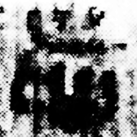
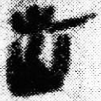
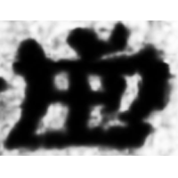
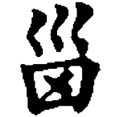
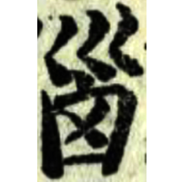

+++
radical = "47"
weight = 3
+++

| Qin | Qin | Han | Tang | Ming |
| ----- | ----- | ----- | ----- | ----- |
|  |  |  |  |  |
| 里耶8-860 [匘] | 睡.封57 | 敦667 [腦] | 五經文字 [腦] | 洪武正韻 [腦] |

?{腦} \*nˤ\[u\]ʔ "brain"

Shortened form of [匘](https://panatesu.github.io/glyph-origins/radicals/21/#U%2b5318) \*NU.

- 陳劍 2004 - 郭店簡《六德》用爲“柔”之字考釋
- 鄔可晶 2018 - “夒”及有關諸字綜理
