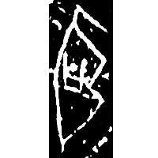
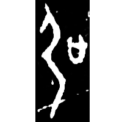
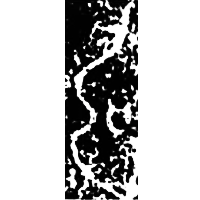
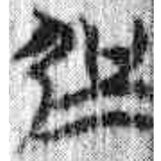
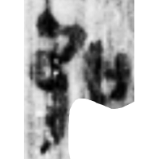

+++
radical = "57"
weight = 4
+++

| Shang (Bin) | Shang (Bin) | Shang (Huang) | Early W.Zhou | Zhanguo (Chu) | Qin |
| ----- | ----- | ----- | ----- | ----- | ----- |
|  |  |  |  |  |  |
| 合3083正 | 合4771 | 合35673 | 集5257 | 包103 [𰐓] | 里耶8-1824 [強] |

{強} \*N.kaŋ "strong"

[弓](https://panatesu.github.io/glyph-origins/radicals/57/#U%2b5F13) *BOW* + differentiative 口. The modern form is a *liding*.

- 裘錫圭 1982 - 甲骨文字考釋(續)・釋“弘”“強”
- 季旭昇 2014 - 說文新證 [2nd ed.] (880)
