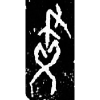
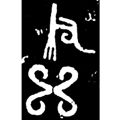

+++
radical = "129"
weight = 6
+++

| Shang (Bin) | Shang |
| ----- | ----- |
|  |  |
| 合6053 | 集3074 |

{畫} \*ɡʷˤrek "to draw"

[聿](https://panatesu.github.io/glyph-origins/radicals/129/#U%2b807F) *BRUSH* + ♪[乂](https://panatesu.github.io/glyph-origins/radicals/4/#U%2b4E42)² \*KᵂE(K).

- 金祥恒 1971 - 說卜辭中之子畫
- 孫常敘 1982 - 則、灋度量則、則誓三事試解》
- 李守奎 2016 - 釋楚簡中的「規」――兼說「支」亦「規」之表意初文
- 陳劍 2017 - 說「規」等字並論一些特別的形聲字意符
