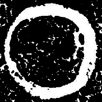
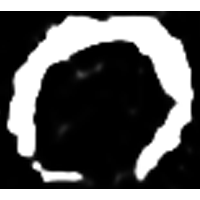
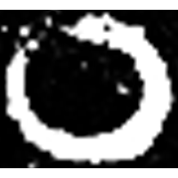

+++
radical = "215"
weight = 0
+++

#### 〇¹

#### 〇²

| Shang | Shang (Shi) | Early (W.Zhou) |
| ----- | ----- | ----- |
|  |  |  |
| 集1065 | 合20592 [員] | 集5861 [員] |

{圓} \*\[w\]ran "round" & {環} \*C.\[w\]ˤren "round object"

Depiction of a circle. The modern form is a *liding*.

- 裘錫圭 2013 - 文字學概要 \[2nd ed.\] \[2021 form.\] (157)
- 布之道 2022 - 廣韻形聲考

#### 〇³
