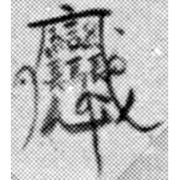
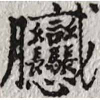

+++
radical = "162"
weight = 8
+++

| Qing | Qing | PRC | PRC |
| ----- | ----- | ----- | ----- |
|  |  |  |  |
| 洪門會場陳設圖 | (Unknown) | 宋友權 《時空成霰媒體職場隨想錄》 | Toa Payoh 2023 |

{兵} *bīng* "soldier" ♪→ {𰻞(𰻞麵)} *biáng*(*biáng miàn*) "*biangbiang* noodles"

From a Hongmen society secret Taoist talisman-like symbol composed of [戀](https://panatesu.github.io/glyph-origins/radicals/61/#U%2b6200) "to long for", [汨](https://panatesu.github.io/glyph-origins/radicals/85/#U%2b6C68) "Ming dynasty", [戈](https://panatesu.github.io/glyph-origins/radicals/62/#U%2b6208) "spear; weapon", [馬](https://panatesu.github.io/glyph-origins/radicals/187/#U%2b99AC) "people" (southeastern secret societies slang) and two [長](https://panatesu.github.io/glyph-origins/radicals/168/#U%2b9577) "long", conveying meanings "to long for the Ming" and "strong weapons and sturdy horses/people, long-devoted members of the organization". Later 穴 (comes either from 共 \< [洪](https://panatesu.github.io/glyph-origins/radicals/85/#U%2b6D2A) as in 洪門 "Hongmen" or from distorted [雨](https://panatesu.github.io/glyph-origins/radicals/173/#U%2b96E8) "rain" from typical Taoist characters or talismans) was added and [戈](https://panatesu.github.io/glyph-origins/radicals/62/#U%2b6208) was changed to a synonymoys [刀](https://panatesu.github.io/glyph-origins/radicals/18/#U%2b5200) "knife". This and many other related characters were used for many different words; the usage of these characters for {𰻞(𰻞麵)} is based on one of their usages for {兵}.

- 王謝楊 2023 - 是biang，是shuar，還是賊？——談源於清代洪門祕符的複雜漢字

**Forms:**

𰻞 - Shortening based on the analogical 馬 \> 马 and 長 \> 长.
