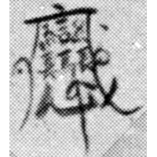
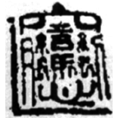
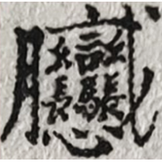

+++
radical = "162"
weight = 8
+++

| Qing | Qing | PRC | PRC |
| ----- | ----- | ----- | ----- |
|  |  |  |  |
| 洪門會場陳設圖 | (Unknown) | 宋友權 《時空成霰媒體職場隨想錄》 | Toa Payoh 2023 |

{兵} *bīng* "soldier" ♪→ {𰻞(𰻞麵)} *biáng*(*biáng miàn*) "*biangbiang* noodles"

From a Hongmen society secret Taoist talisman-like symbol composed of  "to long for",  "Ming dynasty",  "spear; weapon",  "people" (southeastern secret societies slang) and two  "long", conveying meanings "to long for the Ming" and "strong weapons and sturdy horses/people, long-devoted members of the organization". Later 穴 (comes either from 共 \<  as in 洪門 "Hongmen" or from distorted  "rain" from typical Taoist characters or talismans) was added and  was changed to a synonymoys  "knife". This and many other related characters were used for many different words; the usage of these characters for {𰻞(𰻞麵)} is based on one of their usages for {兵}.

- 王謝楊 2023 - 是biang，是shuar，還是賊？——談源於清代洪門祕符的複雜漢字

**Forms:**

 - Shortening by analogy with 馬 \> 马 and 長 \> 长.
