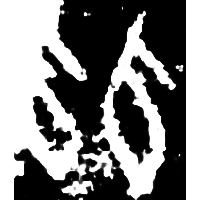
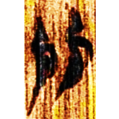
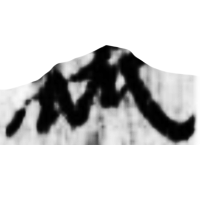

+++
radical = "97"
weight = 2
+++

| Shang (Bin) | Zhanguo (Chu) | W.Han | Han | Tang | Qin |
| ----- | ----- | ----- | ----- | ----- | ----- |
|  |  |  |  |  |  |
| 合2832正乙 | 上八.命9 | 北.蒼25 [蓏] | 敦213 [窳] | 開石.周易8 [蓏] | 內本康熙 |

{卣} \*lu(ʔ) “*you* vessel” ♪→ {㼌} \*loʔ "weak"

Two [瓜](https://panatesu.github.io/glyph-origins/radicals/97/#U%2b74DC) \*LU.

- 陳劍 2020 - 釋“瓜”
