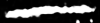
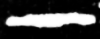
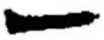
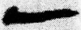
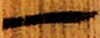
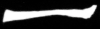
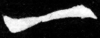

+++
weight = 1
radical = "1"
+++

| Shang (Shi) | Late W.Zhou | Chunqiu (Jin) | Qin | W.Han | E.Han | W.Jin | Nanbei (N.Wei) | Tang |
| ----- | ----- | ----- | ----- | ----- | ----- | ----- | ----- | ----- |
|  |  |  |  |  |  |  |  |  |
| 合20616 | 近出345 | 溫縣T1K1:2279 | 睡.效51 | 北.老6 | 乙瑛碑 | 郭槐柩記 | 元壽安墓誌 | 五經文字 |

{一} \*ʔit "one"

Depiction of a single line.

- 季旭昇 2014 - 說文新證 \[2nd ed.\] (37-39)
- 裘錫圭 2013 - 文字學概要 \[2nd ed.\] \[2021 form.\] (3-5)
