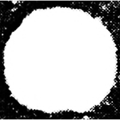
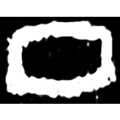
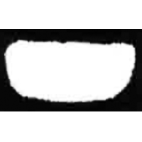
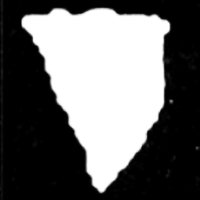
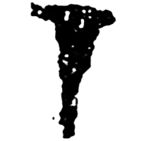
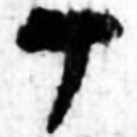
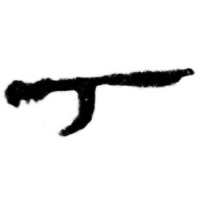
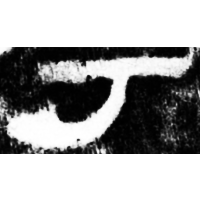
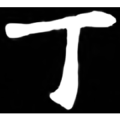

+++
weight = 11
radical = "1"
+++

| Shang | Shang (Shi) | Early W.Zhou | Middle W.Zhou | Zhanguo (Jin) | Zhanguo (Jin) | Qin | Han | E.Han | Nanbei (N.Wei) |
| ----- | -----  | ----- | ----- | ----- | ----- | ----- | ----- | ----- | ----- |
|  |  |  |  |  |  |  |  |  |  |
| 集1289 | 合1893 | 集6495 | 新收1845 | 集226 | 璽彙3167 | 睡.日乙33 | 居舊10.34A | 孔宙碑 | 魏郭顯墓誌 |

{頂} \*tˤeŋʔ "head" ♪→ {丁} \*tˤeŋ "*ding* (4th heavenly stem)"

Abstract depiction of a human head.

- 于省吾 1979 - 甲骨文字釋林・釋具有部分表音的獨體象形字 (439-441)
