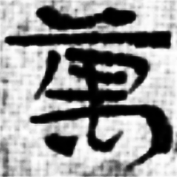
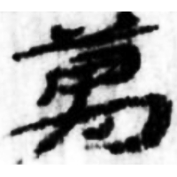
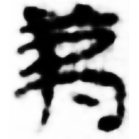
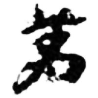
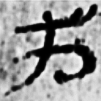
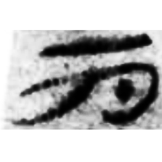
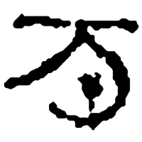
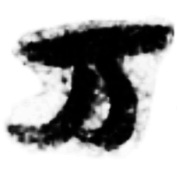
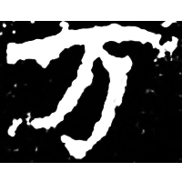
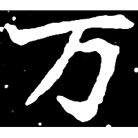

+++
weight = 1
radical = "1"
+++

| Han | Han | Han | Han | Han | Han | Han | Han | Han | Nanbei (N.Wei) | Nanbei (N.Wei) |
| ----- | ----- | ----- | ----- | ----- | ----- | ----- | ----- | ----- | ----- | ----- |
|  |  |  |  |  |  |  |  |  |  |  |
| 居新EPF22.11 | 敦555 | 居舊231.116 | 敦2189 | 額2000ES7SF:16A | 肩73EJT9:136 | 居舊484.2 | 千萬鉤 | 居舊97.1B | 南0288X | 魏元崇業墓誌 |

Shortening of [萬](https://panatesu.github.io/glyph-origins/radicals/114/#U%2b842C) based on the early cursive form. Modern simplified form of [萬](https://panatesu.github.io/glyph-origins/radicals/114/#U%2b842C) in China and Japan.

- 李洪財 2021 - 俗字演變與探源舉例二則
