+++
weight = 1
radical = "1"
+++

| Han | Han | W.Han | W.Han | Han | Han | W.Han | W.Han | W.Han | W.Han | Nanbei (N.Wei) |
| ----- | ----- | ----- | ----- | ----- | ----- | ----- | ----- | ----- | ----- | ----- |
| 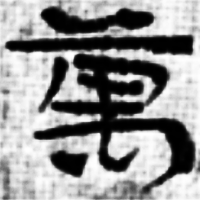 | 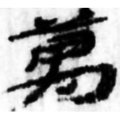 | 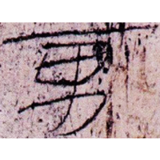 | 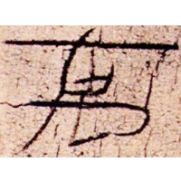 | 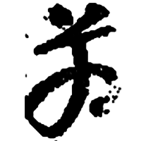 | 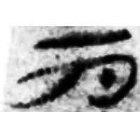 | 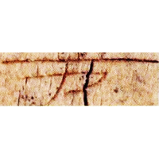 | 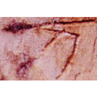 | 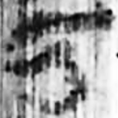 | 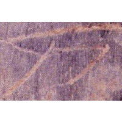 |  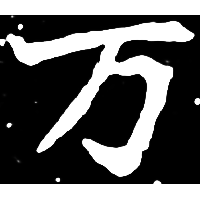 |
| 居新EPF22.11 | 敦555 | 骨4117 | 骨5465 | 額2000ES7SF:16A | 居舊484.2 | 骨910 | 骨47076 | 天回.文1 | 骨32605 | 魏元崇業墓誌 |

Shortening of  based on the early cursive form. Modern simplified form of  in China and Japan.

- 李洪財 2021 - 俗字演變與探源舉例二則
