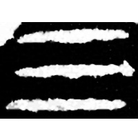
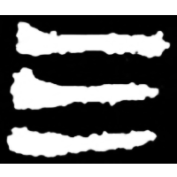
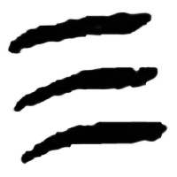
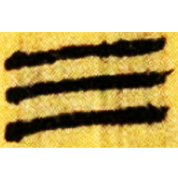
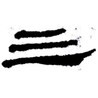
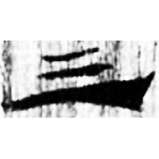
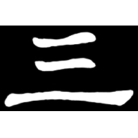

+++
weight = 1
radical = "1"
+++

| Shang (Bin) | Middle W.Zhou | Qin | W.Han | Han | E.Han | Nanbei (N.Wei) |
| ----- | ----- | ----- | ----- | ----- | ----- | ----- |
|  |  |  |  |  |  |  |
| 合20666 | 集2754 | 嶽二.數97 | 北.荊Z2 | 居舊255.23 | 五.行91 | 元文墓誌 |

{三} \*sˤum "three"

Depiction of three lines.

- 季旭昇 2014 - 說文新證 \[2nd ed.\] (51)
- 裘錫圭 2013 - 文字學概要 \[2nd ed.\] \[2021 form.\] (3-5)
