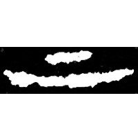
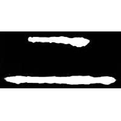
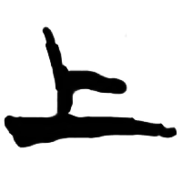
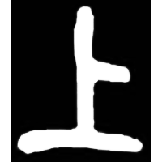
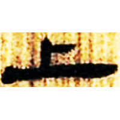
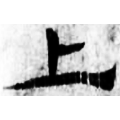
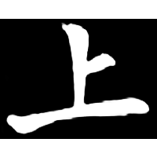

+++
weight = 20
radical = "1"
+++

| Shang (Shi) | Shang (Bin) | Late W.Zhou | Chunqiu (Jin) | Zhanguo (Qin) | W.Han | E.Han | Nanbei (N.Wei) |
| ----- | ----- | ----- | ----- | ----- | ----- | ----- | ----- |
|  |  |  |  |  |  |  |  |
| 合20024 | 合7428 | 集260.2 | 侯馬92:38 [𫵁] | 集證21 | 北.老205 | 五.行359 | 南0147X |

{上} \*daŋs "up"

Depiction of a short line above a long line. Later a vertical line was
added.

- 季旭昇 2014 - 說文新證 \[2nd ed.\] (43-45)

**Forms:**

丄 - Copy of the small seal script form from *Shuowen Jiezi*.
