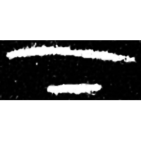
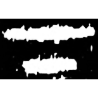
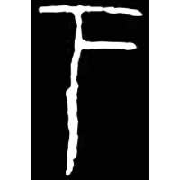
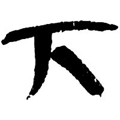
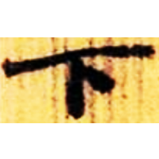

+++
weight = 21
radical = "1"
+++

| Shang (Bin) | Late W.Zhou | Chunqiu (Chu) | Zhanguo (Qin) | Qin | W.Han | Nanbei (N.Wei) |
| ----- | ----- | ----- | ----- | ----- | ----- | ----- |
|  |  |  |  |  |  |  |
| 合6482正 | 集2836 | 新收490 | 駰乙.背 | 北.白囊 | 北.老40 | 李璧墓誌陽 |

{下} \*ɡrˤaʔ "down"

Depiction of a short line below a long line. Later a vertical line was
added.

- 季旭昇 2014 - 說文新證 \[2nd ed.\] (47-48)

**Forms:**

丅 - Copy of the small seal script form from *Shuowen Jiezi*.
