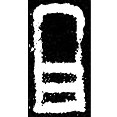
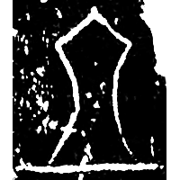
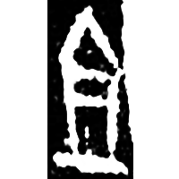
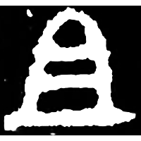
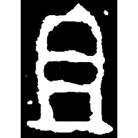
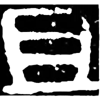
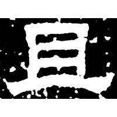

+++
weight = 30
radical = "1"
+++

| Shang (Shi) | Shang (Wu) | Shang (Wuming) | Early W.Zhou | Middle W.Zhou | Qin | E.Han | Nanbei (N.Wei) |
| ----- | ----- | ----- | ----- | ----- | ----- | ----- | ----- |
|  |  |  |  |  |  |  |  |
| 合20045 | 合22053 | 合27374 | 集3991 | 集4288.1 | 陶錄6.441.4 | 熹經237 | 魏元顯儁墓誌 |

{俎} \*tsraʔ "cutting board" ♪→ {且} \*tsʰaʔ "also"

Depiction of a cutting board.

- 季旭昇 2014 - 說文新證 \[2nd ed.\] (932)
- 陳劍 2008 - 甲骨金文舊釋“䵼”之字及相關諸字新釋

**Forms:**

𠀇 𠀃 - Transmitted ancient form. Also, shortened form.
