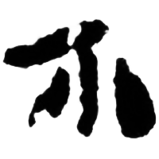
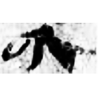
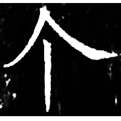

+++
weight = 1
radical = "2"
+++

| W.Han | Han | Tang |
| ----- | ----- | ----- |
|  |  |  |
| 孔.日書41 [介] | 額2000ES7SF1:2A [介] | 開石.儀禮5 |

{個/箇/个} *kaH* "*general classifier*"

Shortened form of 介 *KƐJ*.

- 李建平 2017 - 先秦兩漢量詞研究 (57-63)