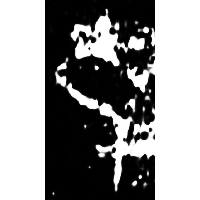
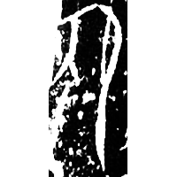
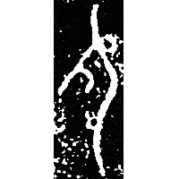
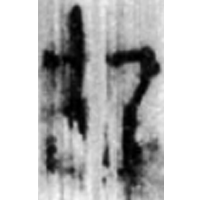
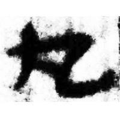
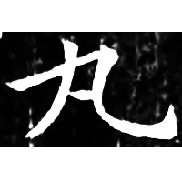

+++
radical = "3"
weight = 1
+++

| Shang (Shi-Bin) | Shang (Bin) | Early W.Zhou | Qin | Han | Tang |
| ----- | ----- | ----- | ----- | ----- | ----- |
|  |  |  |  |  |  |
| 合14295 | 合14294 | 集10308 | 關321 | 河西.醫(1)7 | 開石.毛詩16 |

{宛} \*ʔʷa\[r\]ʔ "crooked" ♪→ {丸} \*\[w\]ˤar "round"

Depiction of a bent person.

- 鄔可晶 2021 - “丸”字續釋——從清華簡所見的一種“邍”字談起
