+++
radical = "3"
weight = 1
+++

| Shang (Bin) | Shang (Bin) | Shang (Bin) | Middle W.Zhou | Chunqiu (Qin) | Zhanguo (Qin) | Qin | Qin | Qin | W.Han | E.Han | Nanbei (N.Wei) |
| ----- | ----- | ----- | ----- | ----- | ----- | ----- | ----- | ----- | ----- | ----- | ----- |
| 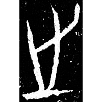 | 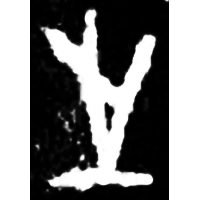 | 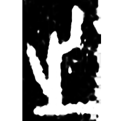 | 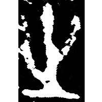 | 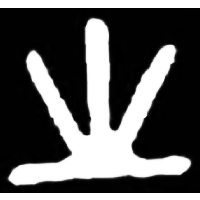 | 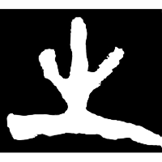 | 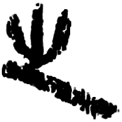 | 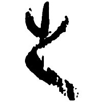 | 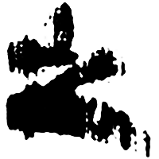 | 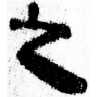 | 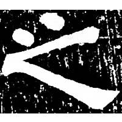 | 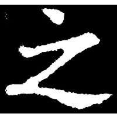 |
| 合12532正 | 合7851正 | 合6483正 | 銘圖5213 | 珍秦金46 | 駰乙.正 | 北.泰原 | 北.泰原 | 北.從政 | 銀二1566 | 張君碑 | 元淑墓誌 |

{之} \*tə "to go"

Either depiction of a foot ([止](https://panatesu.github.io/glyph-origins/radicals/77/#U%2b6B62)) going from a starting point or ♪[止](https://panatesu.github.io/glyph-origins/radicals/77/#U%2b6B62)
\*TƏ + differentiative line.

- 黃德寬 (ed.) 2007 - 古文字譜系疏證 (99-101)
