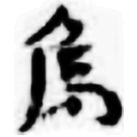
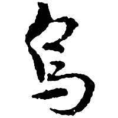
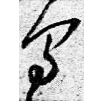
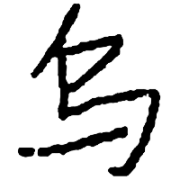

+++
radical = "4"
weight = 1
+++

| Han | Sanguo (Wu) | Ming | ROC |
| ----- | ----- | ----- | ----- |
|  |  |  |  |
| 肩73EJT37:1091 | 皇象 | 秋興八首冊 | 常用簡字表 |

Shortening of [烏](https://panatesu.github.io/glyph-origins/radicals/86/#U%2b70CF) based on the cursive form. Modern simplified form of [烏](https://panatesu.github.io/glyph-origins/radicals/86/#U%2b70CF) in China.

- Bökset R. 2021 - Long Story of Short Forms: Simplified Chinese Characters from A to Z (303)
