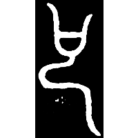
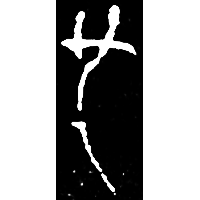
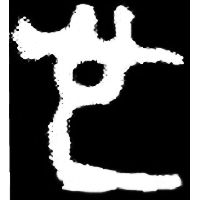
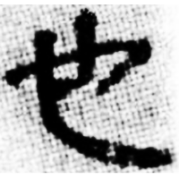
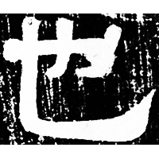
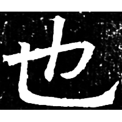

+++
radical = "5"
weight = 1
+++

| Chunqiu (Chu) | Chunqiu (Chu) | Zhanguo (Jin) | Zhanguo (Qin) | Qin | W.Han | E.Han | Nanbei (N.Qi) |
| ----- | ----- | ----- | ----- | ----- | ----- | ----- | ----- |
|  |  |  |  |  |  |  |  |
| 銘圖3036 [号] | 集10008 | 集2764 | 駰乙.正 | 秦銘131 | 張.二95 | 張君碑 | 高淯墓誌 |

{也} \*lajʔ "to be"

Shortened form of [号](https://panatesu.github.io/glyph-origins/radicals/30/#U%2b53F7) \*LE.

- 黃德寬 1997 - 說“也”
- 李家浩 2008 - 釋老簋銘文中的“⿰氵⿸虍也”字——兼談“只”字的來源
