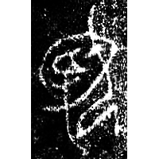
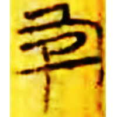
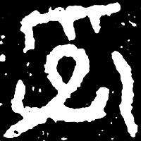
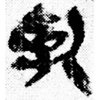
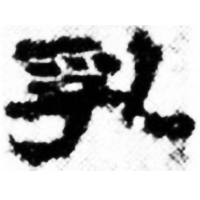
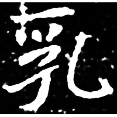
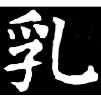

+++
radical = "5"
weight = 1
+++

| Shang (Funü) | Chunqiu (Zeng) | Zhanguo (Chu) | Qin | Qin | W.Han | Nanbei (N.Wei) | Tang |
| ----- | ----- | ----- | ----- | ----- | ----- | ----- | ----- |
|  |  |  |  |  |  |  |  |
| 合22246 | 銘圖15491 | 上三.周2 | 鑒印96 | 睡.日甲29反 | 武.甲服54 | 元延明墓誌 | 唐1602X |

{乳} \*noʔ "to breastfeed"

Depiction of a woman ([女](https://panatesu.github.io/glyph-origins/radicals/38/#U%2b5973)) breastfeeding a child ([子](https://panatesu.github.io/glyph-origins/radicals/39/#U%2b5B50)).

- 趙平安 2011 - 釋戰國文字中的“乳”字
- 季旭昇 2014 - 說文新證 \[2nd ed.\] (827-828)
