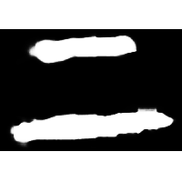
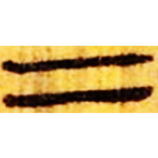
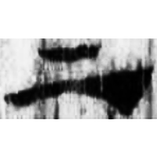
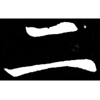

+++
radical = "7"
weight = 1
+++

| Shang (Shu) | Middle W.Zhou | Zhanguo (Qin) | Qin | W.Han | E.Han | Nanbei (N.Wei) |
| ----- | ----- | ----- | ----- | ----- | ----- | ----- |
|  |  |  |  |  |  |  |
| 合19883 | 集4240 | 新收1078 | 睡.日乙45 | 北.老86 | 五.行85 | 元壽安墓誌 |

{二} \*nis "two"

Depiction of two lines.

- 季旭昇 2014 - 說文新證 \[2nd ed.\] (902-903)
- 裘錫圭 2013 - 文字學概要 \[2nd ed.\] \[2021 form.\] (3-5)
