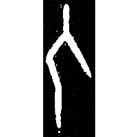
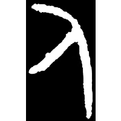
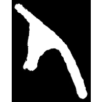
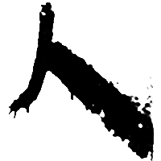
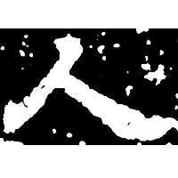
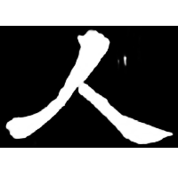

+++
radical = "9"
weight = 1
+++

| Shang (Bin) | Shang (Huang) | Early W.Zhou | Zhanguo (Qin) | Zhanguo (Qin) | Qin | E.Han | W.Jin |
| ----- | ----- | ----- | ----- | ----- | ----- | ----- | ----- |
|  |  |  |  |  |  |  |  |
| 合1031 | 合36483 | 集6001 | 集11394 | 駰乙.正 | 北.泰原 | 熹經282 | 魏晉0019X |

{人} \*niŋ "person"

Depiction of a standing human figure in profile.

- 季旭昇 2014 - 說文新證 \[2nd ed.\] (630)
