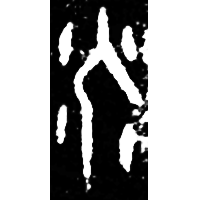
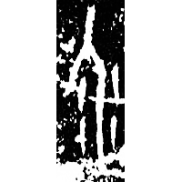
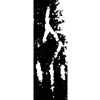
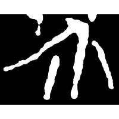
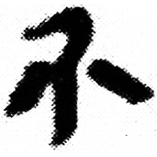
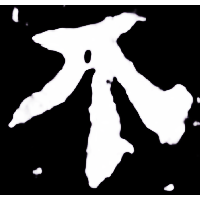
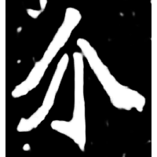
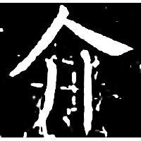

+++
radical = "9"
weight = 1
+++

| Shang (Bin) | Shang (Bin) | Shang (Bin) | Chunqiu (Qin) | Zhanguo (Qin) | Qin | W.Han | E.Han | Nanbei (N.Wei) | Tang |
| ----- | ----- | ----- | ----- | ----- | ----- | ----- | ----- | ----- | ----- |
|  |  |  |  |  |  |  |  |  |  |
| 合816正 | 合19028 | 合12642 | 石鼓.田車 | 駰甲.正 [芥] | 睡.答207 | 孔.日書41 | 潘乾碑 | 南0033X | 唐1354X |

?{疥} \*C.kˤr\[e\]\[p\]s "scabies" ♪→ {介} \*kˤr\[e\]ps "aid"

Unknown. Depiction of a person ([人](https://panatesu.github.io/glyph-origins/radicals/9/#U%2b4EBA)) with small dots around him (probably
represents scabies).

- 黃德寬 (ed.) 2007 - 古文字譜系疏證 (2386)
