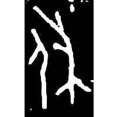
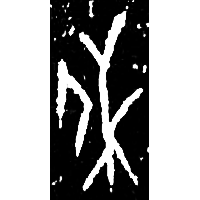
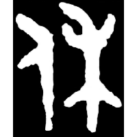
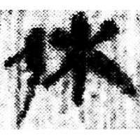

+++
radical = "9"
weight = 1
+++

| Shang (Huadong) | Shang (Bin) | Early W.Zhou | Zhanguo (Qin) | Qin | E.Han | Nanbei (N.Wei) |
| ----- | ----- | ----- | ----- | ----- | ----- | ----- |
|  |  |  |  |  |  |  |
| 花53 | 合8154 | 集2726 | 駰乙.正 | 里耶8-2030正 | 曹全碑 | 元湛墓誌 |

{庥} \*\[n̥\]u "tree shade" / (♪→) {休} \*\[n̥\]u "to rest"

Depiction of a person ([人](https://panatesu.github.io/glyph-origins/radicals/9/#U%2b4EBA)) in a tree shade ([𥝌](https://panatesu.github.io/glyph-origins/radicals/115/#U%2b2574C) \> 木).

- 裘錫圭 2013 - 文字學概要 \[2nd ed.\] \[2021 form.\] (193-195)
- 王子楊 2016 - 釋花東甲骨卜辭中的“𥝌”
