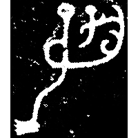
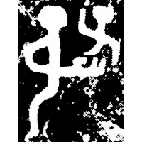
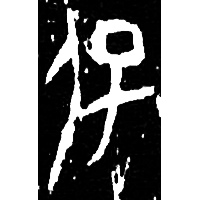
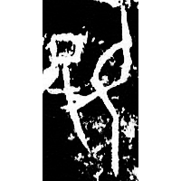
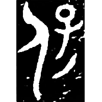
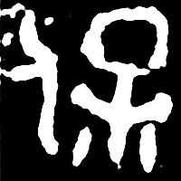
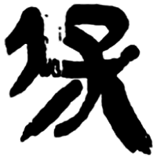
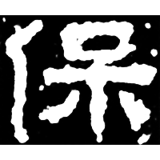
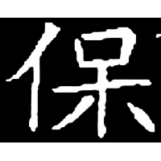

+++
radical = "9"
weight = 1
+++

| Shang | Shang | Shang (Shi) | Shang (Bin) | Shang (Bin) | Early W.Zhou | Middle W.Zhou | Late W.Zhou | Qin | E.Han | Sui |
| ----- | ----- | ----- | ----- | ----- | ----- | ----- | ----- | ----- | ----- | ----- |
|  |  |  |  |  |  |  |  |  |  |  |
| 集9214 | 集1001 | 合20305 | 合8670 | 合10133正 | 集5415.1 | 集181.2 | 集9641 | 北.算甲 | 衡方碑 | 郭世昌墓誌 |

{保} \*pˤuʔ "to protect"

Depiction of a person ([人](https://panatesu.github.io/glyph-origins/radicals/9/#U%2b4EBA)) holding a child ([子](https://panatesu.github.io/glyph-origins/radicals/39/#U%2b5B50)) behing his back.

- 唐蘭 1935 - 殷虛文字記・釋保
- 謝明文 2015 - 釋甲骨文中的“抱”——兼論“包”字
