+++
radical = "10"
weight = 1
+++

| Shang (Bin) | Shang (Wuming) | Chunqiu (Jin) | Zhanguo (Chu) | Zhanguo (Chu) | Zhanguo (Chu) | Zhanguo (Qi) | W.Han | E.Han | Nanbei (E.Wei) | Nanbei (E.Wei) | Tang |
| ----- | ----- | ----- | ----- | ----- | ----- | ----- | ----- | ----- | ----- | ----- | ----- |
| 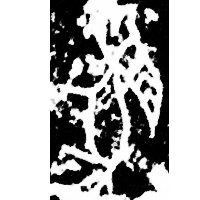 | 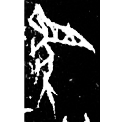 | 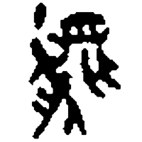 | 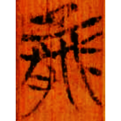 | 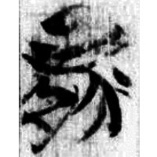 | 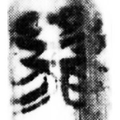 |  | 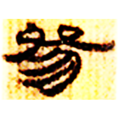 | 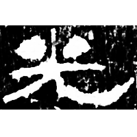 | 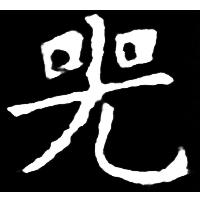 | 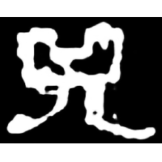 | 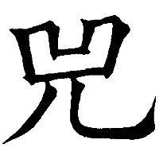 |
| 合10407正 | 合28401 | 侯馬67:39 | 包48 | 包18 | 仰32 | 璽彙153 | 北.老35 | 孔宙碑 | 劉懿墓誌 | 元悰墓誌 | 五經文字 |

{兕} \*sV.liʔ "*Bubalus mephistopheles* (short-horned water buffalo)"

Depiction of a water buffalo.

- 唐蘭 1932 - 獲白兕考
- 單育辰 2015 - 說「兕」「象」——「甲骨文所見的動物」之六
- 徐在國 2017 - 談楚文字中的「兕」
- 李豪 2021 - 結合古文字和文獻用字論「兕」「弟」「雉」等字的上古聲母
- 于夢欣 2021 - 試說古文字中的「兕」
