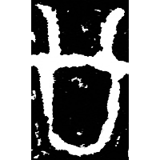
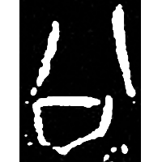
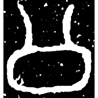
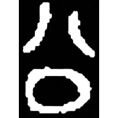
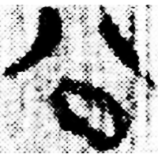
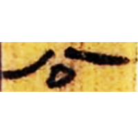
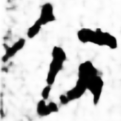
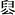

+++
radical = "12"
weight = 1
+++

| Shang | Shang (Wuming) | Middle W.Zhou | Late W.Zhou | Qin | W.Han | Han | Nanbei (N.Wei) |
| ----- | ----- | ----- | ----- | ----- | ----- | ----- | ----- |
|  |  |  |  |  |  |  |  |
| 集6911 \[\] | 懷1465 | 近二388 | 集4384 | 里耶8-1791 | 北.老17 | 敦2401A | 尉遲氏造像 |

{罋/甕/瓮} \*ʔ.lˤoŋ "earthen jar" ♪→ {公} \*k.lˤoŋ "public"

Depiction of an earthen jar.

- 朱芳圃 1962 - 殷周文字釋叢
- 方述鑫 1982 - 甲骨文口形偏旁釋例
- 季旭昇 2014 - 說文新證 \[2nd ed.\] (86-87)
