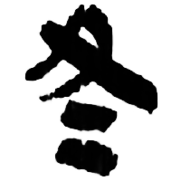
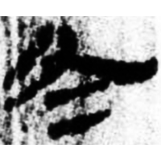
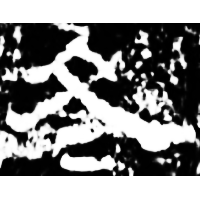

+++
radical = "15"
weight = 1
+++

| Zhanguo (Qin) | Qin | W.Han | E.Han | Nanbei (N.Wei) |
| ----- | ----- | ----- | ----- | ----- |
|  |  |  |  |  |
| 駰甲.正 | 嶽一.爲66正 | 銀二1647 | 楊著碑 | 元願平妻墓誌 |

{冬} \*tˤuŋ "winter"

♪[𠂂](https://panatesu.github.io/glyph-origins/radicals/3/#U%2b20082) \*TUŊ + differentiative lines.

- 黃德寬 (ed.) 2007 - 古文字譜系疏證 (1157-1159)
