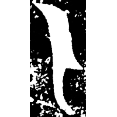
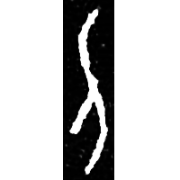
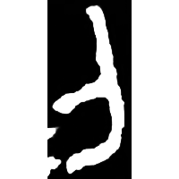
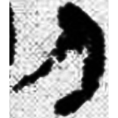
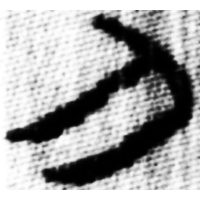
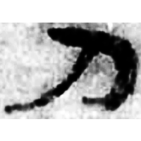
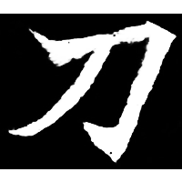

+++
radical = "18"
weight = 1
+++

| Shang | Shang (Shi) | Late W.Zhou | Qin | W.Han | E.Han | Nanbei (N.Wei) |
| ----- | ----- | ----- | ----- | ----- | ----- | ----- |
|  |  |  |  |  |  |  |
| 集2136 | 合22474 | 集10176 [則] | 睡.爲41 [則] | 張.奏199 | 五.木牘336B | 寇憑墓誌 |

{刀} \*C.tˤaw "knife"

Depiction of a knife.

- 季旭昇 2014 - 說文新證 [2nd ed.] (352)
