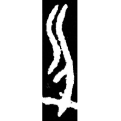
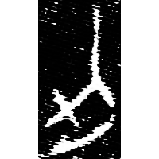
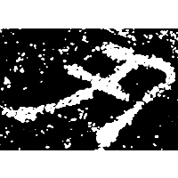
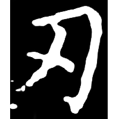
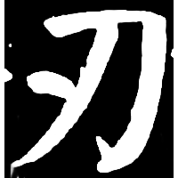
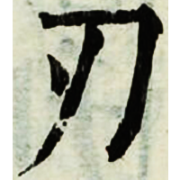

+++
radical = "18"
weight = 1
+++

| Shang (Shi-Bin) | Zhanguo (Jin) | Qin | E.Han | Nanbei (N.Wei) | Tang | Tang | Ming |
| ----- | ----- | ----- | ----- | ----- | ----- | ----- | ----- |
|  |  |  |  |  |  |  |  |
| 合117 | 集9735 [忍] | 睡.封67 | 趙寬碑 | 爾朱紹墓誌 | 唐1475X | 唐1404C | 字彙 |

{刃} \*nə[n]s "blade"

Depiction of a knife ([刀](https://panatesu.github.io/glyph-origins/radicals/18/#U%2b5200)) with an indicative line over its blade.

- 季旭昇 2014 - 說文新證 [2nd ed.] (360)
