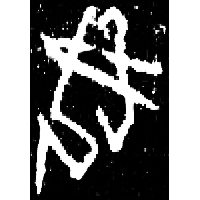
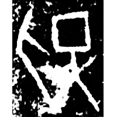
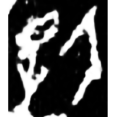
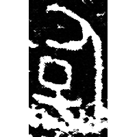
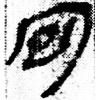
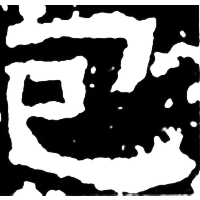
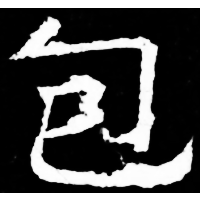
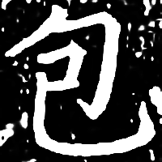

+++
radical = "20"
weight = 1
+++

| Shang (Shi-Bin) | Shang (Bin) | Shang (Wuming) | Early W.Zhou | Qin | E.Han | Nanbei (N.Qi) | Ming |
| ----- | ----- | ----- | ----- | ----- | ----- | ----- | ----- |
|  |  |  |  |  |  |  |  |
| 英1854 | 合16429 | 合26986 | 銘圖9820 [玸] | 睡.答61 | 熹經517 | 高淯墓誌 | 賜經之碑 |

{抱} \*\[m.p\]ˤuʔ "to embrace" ♪→ {包} \*pˤru "to wrap"

Depiction of a person ([女](https://panatesu.github.io/glyph-origins/radicals/38/#U%2b5973)/[人](https://panatesu.github.io/glyph-origins/radicals/9/#U%2b4EBA)) embracing a baby ([子](https://panatesu.github.io/glyph-origins/radicals/39/#U%2b5B50)/[巳](https://panatesu.github.io/glyph-origins/radicals/49/#U%2b5DF3)).

- 謝明文 2015 - 釋甲骨文中的“抱”——兼論“包”字
- 蔣玉斌 2015 - 殷商文字與戰國文字互證兩例
