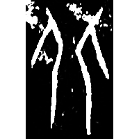
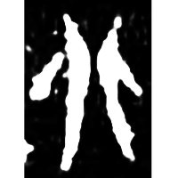
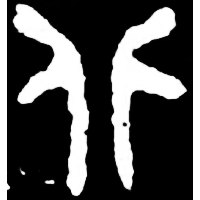
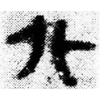
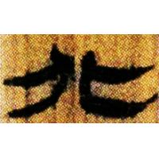
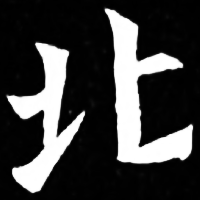
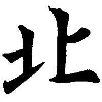
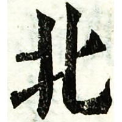

+++
radical = "21"
weight = 1
+++

| Shang (Shi-Bing) | Shang (Huang) | Middle W.Zhou | Qin | W.Han | E.Han | Nanbei (N.Wei) | Tang | Ming |
| ----- | ----- | ----- | ----- | ----- | ----- | ----- | ----- | ----- |
|  |  |  |  |  |  |  |  |  |
| 合9746 | 合36751 | 集9898A | 睡.封57 | 北.雨Z2 | 熹經282 | 南0091X | 五經文字 | 字彙 |

{背} \*m.pˤəks "turn the back on" ♪→ {北} \*pˤək "north"

Depiction of two people ([人](https://panatesu.github.io/glyph-origins/radicals/9/#U%2b4EBA)) turning their backs on each other.

- 季旭昇 2014 - 說文新證 \[2nd ed.\] (651)
