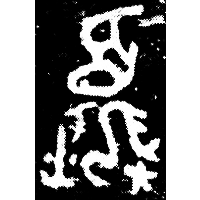
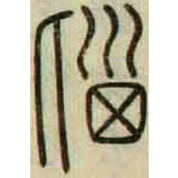
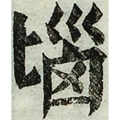

+++
radical = "21"
weight = 1
+++

| Shang (Bin) | Shang (Wuming) | Middle W.Zhou | Zhanguo (Chu) | Qin | E.Han | Ming |
| ----- | ----- | ----- | ----- | ----- | ----- | ----- |
|  |  |  |  |  |  |  |
| 合6304 | 合30298 | 集2831 | 郭.六德32 | 里耶8-860 | 日本說文 | 字彙 |

? ♪→ {腦} \*nˤ\[u\]ʔ "brain"

Depiction of a person holding an axe behing his back. The modern form is
based on a form from *Shuowen Jiezi*.

- 陳劍 2004 - 郭店簡《六德》用爲“柔”之字考釋
- 鄔可晶 2018 - “夒”及有關諸字綜理
