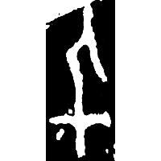
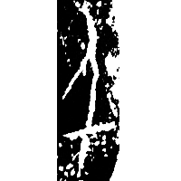
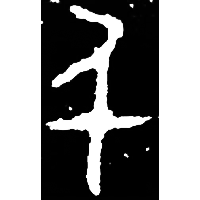
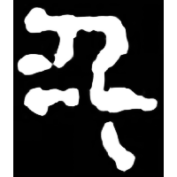
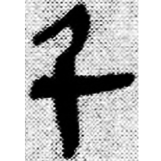
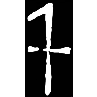
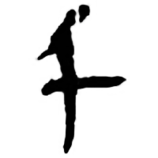
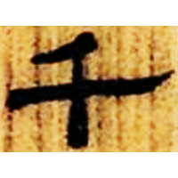

+++
radical = "24"
weight = 1
+++

| Shang (Shi-Bin) | Shang (Bin) | Late W.Zhou | Zhanguo (Qin) | Qin | Qin | Qin | W.Han | Nanbei (N.Wei) |
| ----- | ----- | ----- | ----- | ----- | ----- | ----- | ----- | ----- |
|  |  |  |  |  |  |  |  |  |
| 合4992 | 合14456反 | 集2768 | 青川木牘 | 睡.效9 | 陶錄6.282.4 | 嶽二.數113 | 北.老221 | 南0341X |

{一千} \*ʔit (C)Vs.nˤiŋ "one thousand" → {千} \*(C)Vs.nˤiŋ "thousand"

Initially the word {千} was written phonetically as [人](https://panatesu.github.io/glyph-origins/radicals/9/#U%2b4EBA) \*NIŊ. The glyph
[一](https://panatesu.github.io/glyph-origins/radicals/1/#U%2b4E00) *ONE* was added to represent the compound {一千}, giving the ligature 千. Later this ligature began to be used for the morpheme {千} itself.

- 張秉權 1975 - 甲骨文中所見的「數」
