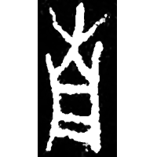
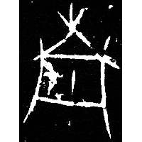
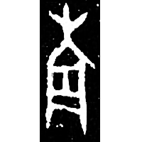
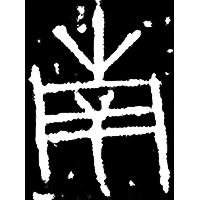
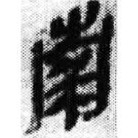
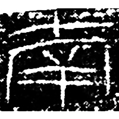
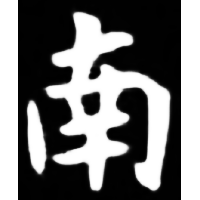
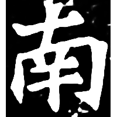

+++
radical = "24"
weight = 1
+++

| Shang (Shi) | Shang (Bin) | Shang (Wuming) | Early W.Zhou | Late W.Zhou | Qin | W.Han | Nanbei (N.Wei) | Sui |
| ----- | ----- | ----- | ----- | ----- | ----- | ----- | ----- | ----- |
|  |  |  |  |  |  |  |  |  |
| 合20576正 | 合14294 | 屯2377 | 集2837 | 新收881 | 嶽三83 | 文物研究17 | 魏元珽墓誌 | 隋0122X |

?{醓} \*\[n̥ˤ\]\[ə\]mʔ "bride of pickled mincemeat" ♪→ {南} \*nˤ\[ə\]m
"south"

Depiction of a cylindric vessel (同) with a blade of grass (屮) on top.

- 黃博 2020 - 甲骨文“南”及相關字補說

  
