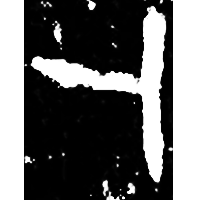
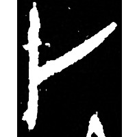
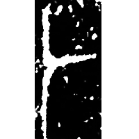
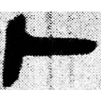
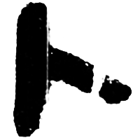

+++
radical = "25"
weight = 1
+++

| Shang (Shi) | Shang (Shi) | Early W.Zhou | Qin | Qin | W.Han | Nanbei (N.Wei) |
| ----- | ----- | ----- | ----- | ----- | ----- | ----- |
|  |  |  |  |  |  |  |
| 合補1594 | 合19946反 | 集3577.1 | 睡.日乙126 | 北.祓除 | 北.荊Z1 | 鄯乾墓誌 |

{卜} \*pˤok "to divine"

Depiction of a crack on an oracle bone.

- 季旭昇 2014 - 說文新證 [2nd ed.] (248)
