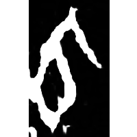
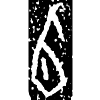
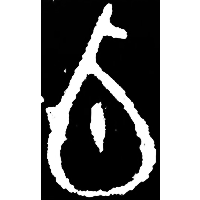
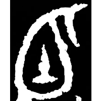
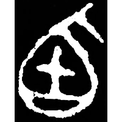
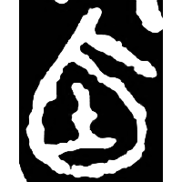
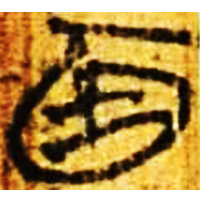
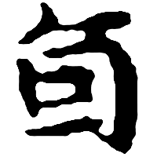
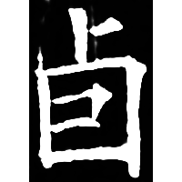

+++
radical = "25"
weight = 1
+++

| Shang (Bin) | Shang (Wuming) | Early W.Zhou | Early W.Zhou | Late W.Zhou | Chunqiu (Qin) | Zhanguo (Chu) | Nanbei (Liang) | Tang |
| ----- | ----- | ----- | ----- | ----- | ----- | ----- | ----- | ----- |
|  |  |  |  |  |  |  |  |  |
| 合17839反 | 合30815 [𪾏] | 集2837 | 集2754 [逌] | 集238.1 | 石鼓.作原 [逌] | 上三.周易42 | 玉篇 [逌] | 開石.爾雅3 |

{卣} \*lu(ʔ) "*you* vessel"

[瓜](https://panatesu.github.io/glyph-origins/radicals/97/#U%2b74DC) + differentiative dot.

- 陳劍 2020 - 釋“瓜”
