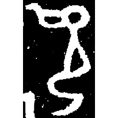
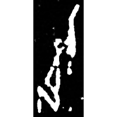
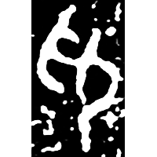
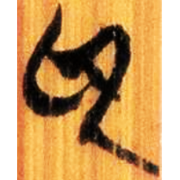
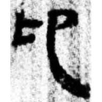
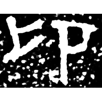
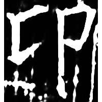

+++
radical = "26"
weight = 1
+++

| Shang | Shang (Shi) | Late W.Zhou | Zhanguo (Chu) | Qin | W.Han | E.Han | Tang |
| ----- | ----- | ----- | ----- | ----- | ----- | ----- | ----- |
|  |  |  |  |  |  |  |  |
| 集2694 | 合20468 | 集2841B | 清六.子產15 | 里耶8-735背 | 張.引17 | 趙寬碑 | 開石.毛詩14 |

{仰} \*C.ŋaŋʔ "to raise the head" ♪→ {卬} \*ŋˤaŋ "I, me"

Depiction of a kneeling person ([卩](https://panatesu.github.io/glyph-origins/radicals/26/#U%2b5369)) whose head is being lifted up by a
hand.

- 紀師 2021 - 釋三晋古璽中的“卬”字
- 鞠煥文 2022 - 釋甲骨金文中的“卬”字
