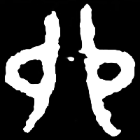
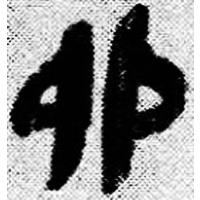
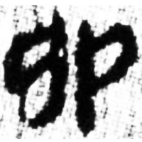
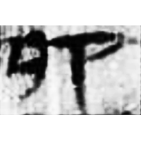
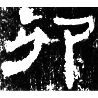
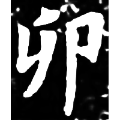

+++
radical = "26"
weight = 1
+++

| Shang (Shi) | Middle W.Zhou | Qin | W.Han | E.Han | E.Han | Nanbei (N.Wei) |
| ----- | ----- | ----- | ----- | ----- | ----- | ----- |
|  |  |  |  |  |  |  |
| 合19798 | 集5996 | 睡.日乙31 | 銀二1725 | 五.木牘315 | 史晨碑 | 南0316X |

?{瘤} \*ru "swelling" ♪→ {卯} \*mˤruʔ "*mao* (4th earthly branch)"

Unknown. Probably doubled depiction of swelling.

- 黃德寬 (ed.) 2007 - 古文字譜系疏證 (741-743)
- 季旭昇 2014 - 說文新證 \[2nd ed.\] (977-978)
