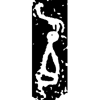
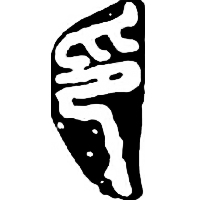
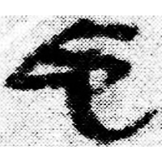
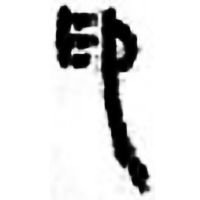
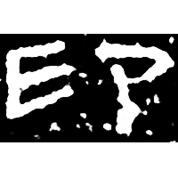

+++
radical = "26"
weight = 1
+++

| Shang | Chunqiu (Zeng) | Qin | Qin | Qin | E.Han | Tang |
| ----- | ----- | ----- | ----- | ----- | ----- | ----- |
|  |  |  |  |  |  |  |
| 銘圖8928 | 集4631 | 集證175.630 | 睡.答56 | 嶽三227 | 張景碑 | 開石.春左37 |

{抑} \*ʔik "to press down" ♪→ {印} \*\[ʔ\]iŋs "seal"

Depiction of a kneeling person ([卩](https://panatesu.github.io/glyph-origins/radicals/26/#U%2b5369)) being pressed with a hand from above ([爪](https://panatesu.github.io/glyph-origins/radicals/87/#U%2b722A)).

- 禤健聰 2014 - 釋“⿳爪卩土”並論“印”“卬”“色”諸字
- 金俊秀 2018 - 聲母構擬三則
