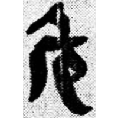
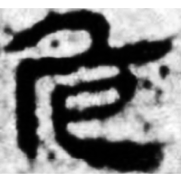
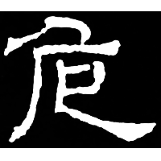

+++
radical = "26"
weight = 1
+++

| Qin | W.Han | W.Jin | Tang | S.Song |
| ----- | ----- | ----- | ----- | ----- |
|  |  |  |  |  |
| 睡.日乙47 | 馬.經35上 | 徐義墓誌 | 五經文字 | 增韻 |

{跪} \*\[g\](r)ojʔ "to kneel" ♪→ {危} \*\[ŋ\](r)\[o\]j "dangerous"

[卩](https://panatesu.github.io/glyph-origins/radicals/26/#U%2b5369) *KNEEL* + ♪[厃](https://panatesu.github.io/glyph-origins/radicals/27/#U%2b5383)¹ \*KOJ.

- 大西克也 2003 - 試論上博楚簡《緇衣》中的“厃”字及相關諸字
