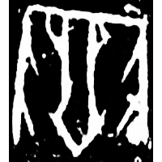
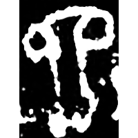
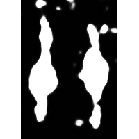
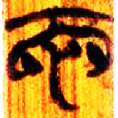
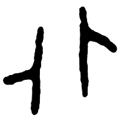
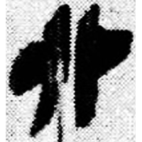
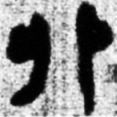
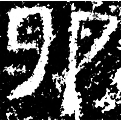
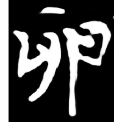
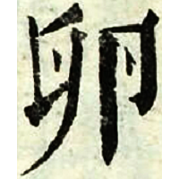

+++
radical = "26"
weight = 1
+++

| Shang (Bin) | Shang (Bin) | Chunqiu (Xu) | Zhanguo (Chu) | Zhanguo (Jin) | Qin | W.Han | E.Han | Nanbei (N.Wei) | Ming |
| ----- | ----- | ----- | ----- | ----- | ----- | ----- | ----- | ----- | ----- |
|  |  |  |  |  |  |  |  |  |  |
| 合18270 | 合525 [剢] | 新收1249 | 清十.病方2 | 錢典333 [𨳡] | 睡.日乙185 | 馬.遣一84 | 郙閣頌 | 元玕墓誌 | 字彙 |

{卵} \*k.rˤorʔ "testicles"

Depiction of male genitals.

- 侯乃峰 2023 - 釋清華簡《病方》篇的“卵”字兼談相關問題
- 季旭昇 2014 - 說文新證 \[2nd ed.\] (901-902)
