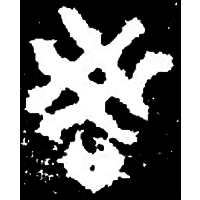
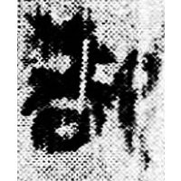
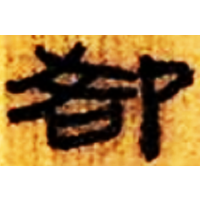
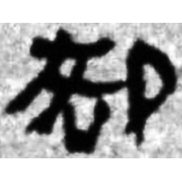
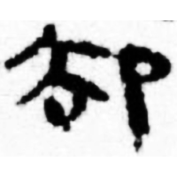
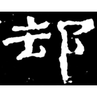
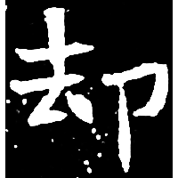
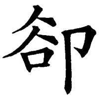

+++
radical = "26"
weight = 1
+++

| Middle W.Zhou | Qin | W.Han | W.Han | W.Han | E.Han | Nanbei (N.Wei) | Tang | Ming |
| ----- | ----- | ----- | ----- | ----- | ----- | ----- | ----- | ----- |
|  |  |  |  |  |  |  |  |  |
| 集2831 [𧮫] | 睡.封66 | 北.老25 | 馬.稱15下 | 馬.春82 | 史晨奏銘 | 元暐墓誌 | 五經文字 | 字彙 |

?{卻} \*\[k\]ʰak "to retreat"

[卩](https://panatesu.github.io/glyph-origins/radicals/26/#U%2b5369) *KNEEL* + ♪[𧮫](https://panatesu.github.io/glyph-origins/radicals/150/#U%2b27BAB) \*KAK (depiction of intertwined threads + differentiative 口 for {綌} \*\[k\]ʰrak "coarse hemp cloth").

- 林澐 1990 - 新版《金文編》正文部分釋字商榷
- 程燕 2018 - “𧮫”字探源——兼釋“𧮫”之相關字

**Forms:**

[却](https://panatesu.github.io/glyph-origins/radicals/26/#U%2b5374) - Alternative form with 𧮫 \> 去. Standard form in Japan and PRC.
