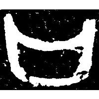
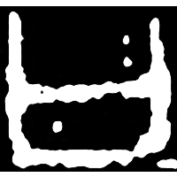
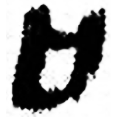
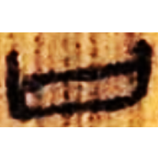
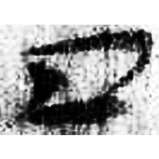
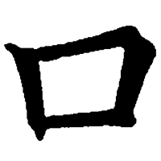

+++
radical = "30"
weight = 1
+++

| Shang | Shang | Early W.Zhou | Qin | W.Han | E.Han | E.Han | Tang |
| ----- | ----- | ----- | ----- | ----- | ----- | ----- | ----- |
|  |  |  |  |  |  |  |  |
| 集5452 | 集8801 | 近二564 | 嶽一.質三12 | 北.老151 | 淮源廟碑 | 五.木牘3A | 五經文字 |

{口} \*kʰˤ(r)oʔ "mouth" & {曰} \*\[w\]at "to say"

Depiction of a mouth. Initially it was used for both words {口} and {曰}. Later it began to be used only for {口}.

- 季旭昇 2014 - 說文新證 \[2nd ed.\] (96)
