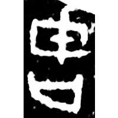
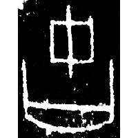
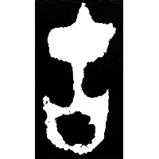
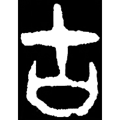
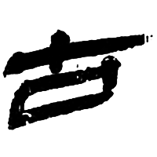
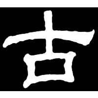
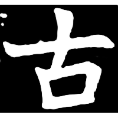

+++
radical = "30"
weight = 1
+++

| Shang (Shi) | Shang (Bin) | Early W.Zhou | Middle W.Zhou | Qin | E.Han | Nanbei (N.Wei) |
| ----- | ----- | ----- | ----- | ----- | ----- | ----- |
|  |  |  |  |  |  |  |
| 合21242 | 合8226正 | 集2837 | 集10175 | 北.算甲 | 華山廟碑 | 南0283X |

{固} \*\[k\]ˤas "solid" ♪→ {古} \*kˤaʔ "old"

[干](https://panatesu.github.io/glyph-origins/radicals/51/#U%2b5E72) *SHIELD* + differentiative 口.

- 裘錫圭 1982 - 甲骨文字考釋(續)・三、釋“弘”“強”
- 季旭昇 2014 - 說文新證 [2nd ed.] (154-155)
