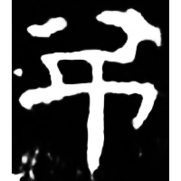
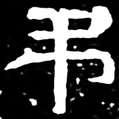
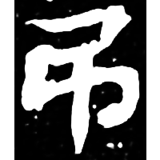
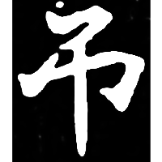
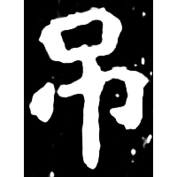

+++
radical = "30"
weight = 1
+++

| E.Han | W.Jin | Nanbei (N.Wei) | Nanbei (N.Wei) | Nanbei (N.Wei) |
| ----- | ----- | ----- | ----- | ----- |
|  |  |  |  |  |
| 衡方碑 [弔] | 魏晉0021X [弔] | 南0044X [弔] | 南0185X [弔] | 南0173A |

{吊/弔} \*tˤ\[e\]wks "to hang"

Differentiated form of [弔](https://panatesu.github.io/glyph-origins/radicals/57/#U%2b5F14).

- 季旭昇 2014 - 說文新證 \[2nd ed.\] (638-640)
