+++
radical = "30"
weight = 1
+++

| Shang (Bin) | Shang (Bin) | Early W.Zhou | Middle W.Zhou | Chunqiu (Qin) | Qin | Qin | Qin | Han | E.Han | Nanbei (N.Wei) | Nanbei (E.Wei) |
| ----- | ----- | ----- | ----- | ----- | ----- | ----- | ----- | ----- | ----- | ----- | ----- |
| 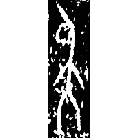 | 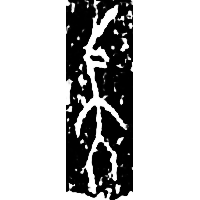 | 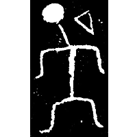 | 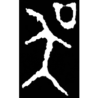 | 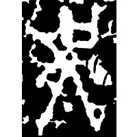 | 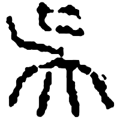 | 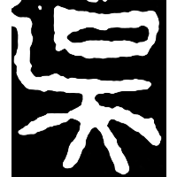 | 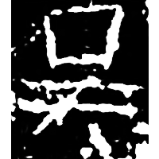 | 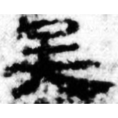 |  | 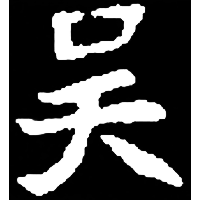 | 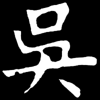 |
| 合16846 | 合補1120 | 集997 | 集4288.1 | 石鼓.吳人 | 傅1427 | 珍秦207 | 陶新267 | 居舊180.8 | 魯峻碑 | 元子永墓誌 | 元光基墓誌 |

?{胡} \*\[ɡ\]ˤa "dewlap" ♪→ {吳} \*ŋʷˤa "Wu (state)"

Uncertain. Probably depiction of a person with a pointer on his jaw/neck.

- 陳劍 2017 - 據《清華簡(伍)》的“古文虞”字説毛公鼎和殷墟甲骨文的有關諸字

**Forms:**

吴 - Alternative form. Standard form in PRC.

呉 - Alternative form. Standard form in Japan.
