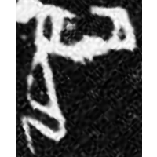
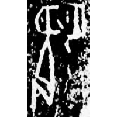
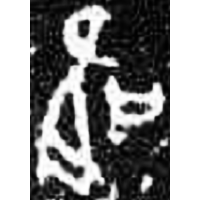
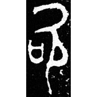
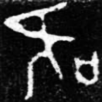

+++
radical = "30"
weight = 1
+++

#### 吹¹

{吹} \*\[tʰ\]o\[r\] "to blow"

Initially the word {吹} was written as [炊](https://panatesu.github.io/glyph-origins/radicals/86/#U%2b708A). Later the left element was replaced with [口](https://panatesu.github.io/glyph-origins/radicals/30/#U%2b53E3) *MOUTH*.

- 陳聞達 2024 - 說“足”字的形體來源兼論相關問題

#### 吹²

{欠} \*kʰams "to yawn"

Either [口](https://panatesu.github.io/glyph-origins/radicals/30/#U%2b53E3) *MOUTH* + shortened ♪[坎](https://panatesu.github.io/glyph-origins/radicals/32/#U%2b574E) \*KƏM or shortened form of [𲊩](https://panatesu.github.io/glyph-origins/radicals/180/#U%2b322A9) ([口](https://panatesu.github.io/glyph-origins/radicals/30/#U%2b53E3) *MOUTH* + [𮲾](https://panatesu.github.io/glyph-origins/radicals/76/#U%2b2ECBE) (distorted form of [𬔧](https://panatesu.github.io/glyph-origins/radicals/117/#U%2b2C527) created for {贛} \*kʰˤəmʔ "to bestow")).

- 布之道 2025 - 說字小記(一)

#### 吹³

| Shang (Shi-Bin) | Shang | Shang (Shi-Bin) | Early W.Zhou | Late W.Zhou |
| ----- | ----- | ----- | ----- | ----- |
|  |  |  |  |  |
| 合9359 | 英2674正 | 合9362 | 集5428.1 | 集9695.1 |

{足} \*\[ts\]ok "to fulfill"

Unclear. A person with an open mouth ([欠](https://panatesu.github.io/glyph-origins/radicals/76/#U%2b6B20)) facing mouth ([口](https://panatesu.github.io/glyph-origins/radicals/30/#U%2b53E3)), sometimes with some particles. The modern form is a *liding*.

- 陳聞達 2024 - 說“足”字的形體來源兼論相關問題
