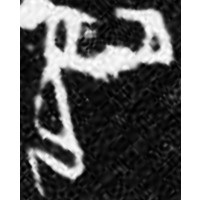
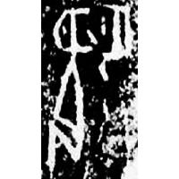
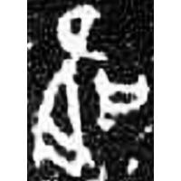
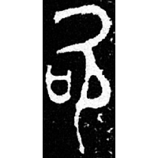
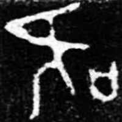

+++
radical = "30"
weight = 1
+++

#### 吹¹

{吹} \*\[tʰ\]o\[r\] "to blow"

Initially the word {吹} was written as . Later the left element was replaced with  *MOUTH*.

- 陳聞達 2024 - 說“足”字的形體來源兼論相關問題

#### 吹²

{欠} \*kʰams "to yawn"

Either  *MOUTH* + shortened ♪ \*KƏM or shortened form of  ( *MOUTH* +  (distorted form of  created for {贛} \*kʰˤəmʔ "to bestow")).

- 布之道 2025 - 說字小記(一)

#### 吹³

| Shang (Shi-Bin) | Shang | Shang (Shi-Bin) | Early W.Zhou | Late W.Zhou |
| ----- | ----- | ----- | ----- | ----- |
|  |  |  |  |  |
| 合9359 | 英2674正 | 合9362 | 集5428.1 | 集9695.1 |

{足} \*\[ts\]ok "to fulfill"

Unclear. A person with an open mouth () facing mouth (), sometimes with some particles. The modern form is a *liding*.

- 陳聞達 2024 - 說“足”字的形體來源兼論相關問題
